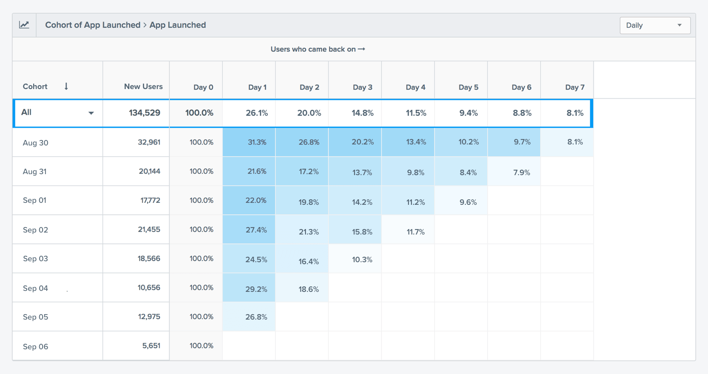
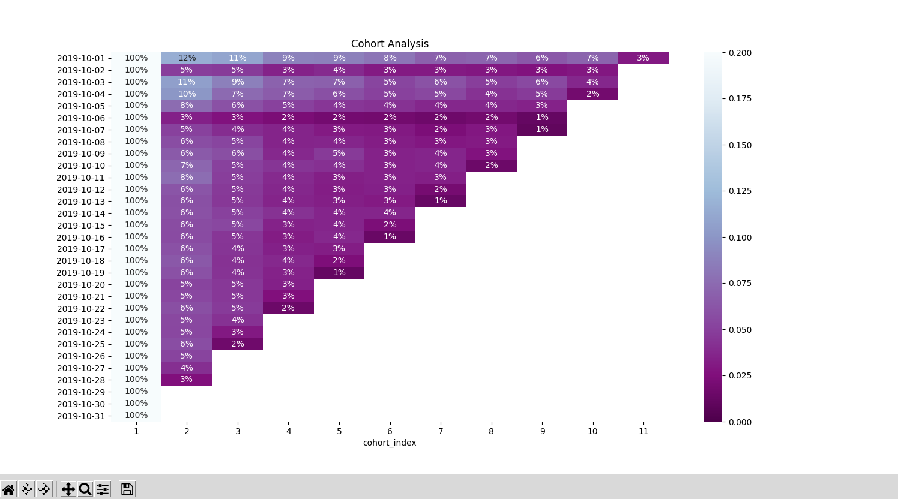
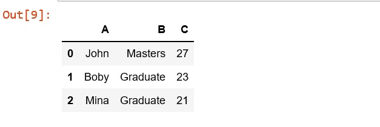
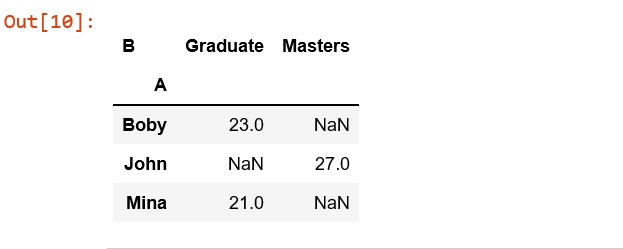
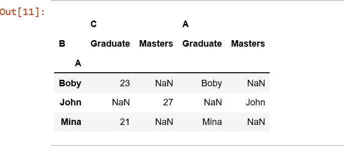

#! https://zhuanlan.zhihu.com/p/370493764

用户留存分析之Cohort模型

# 一、什么是群组分析Cohort Analysis？

Cohort分析又叫同期群分析或分组分析，主要分析相同的用户群体随着时间延续的发展变化情况。

例如，1月份进入的用户群体在1月、2月、3月等的留存、活跃和流失情况。


群组分析Cohort Analysis，是一种利用用户分层&用户建模的方法——你需要你的所有用户分成一个一个小组——你可以按照获客日期来分，或者按照获客渠道来分，或者按照特定用户行为来分——总之，你可以按照任何你想要的维度来进行用户分层&用户建模。

群组分析有利于衡量用户在每个漏斗的用户流失节点、用户流失数据，从而帮助你发现产品的摩擦点和用户的行为模式。从本质上讲，群组分析Cohort Analysis为您提供了一种数据驱动的方法。

下面我们举一个示例——创建第一次启动App的新用户的群组，然后看看有多少人在接下来的10天内回访了App。



- 32,961位新用户于8月30日退出该App，其中31.3％在第1天回访，第4天13.4％的回访，到第7天回访用户只剩8.1％。这意味着在这个产品的7日留存率非常低，相当于每12个用户，只有1个用户会回访。
- 在8月30日至9月6日期间获得的所有新用户中（总共134,529），第1天的留存率仅仅是26.1％，第4天留存率是11.5％，7日留存是8.1％。这意味着流失率达到了92％，前七天我们辛苦拉新的用户几乎都流失了。
> 以上仅仅是一个例子，群组分析维度是按照获客时间来分，教你如何分析留存率。这些数据可以让你重视用户留存的重要性，直观地告诉你用户每一天的流失情况，帮助你分析用户流失的节点，或者驱动你完善用户体验，或者让你重新审视你的产品与市场是否真正契合。

# 二、Cohort分析最常用的场景有哪些？

- 用户留存率分析
- 用户流失率分析
- 用户续费率分析
- 用户退费率分析
- 广告转化率分析

以上是最常用的场合，但可以衍生到诸多场合，比如用户的交易数据，不同月份获取的用户在交易频次、客单价、成交周期的分析等。


总之，只要你愿意思考和想象，Cohort都有助于分析师从更为细分的群体去观察这些群体的行为和交易的变化发展情况。

# 三. Python进行Cohort分析

这次选用的数据集是某美妆电商的一个月内的真实会话数据集（数据集链接在文章最后），记录下来阅览、加购、移除购物车和购买四种类型的所有会话。每个会话都记录了对应的会话ID，User ID，商品ID和商品价格等信息。

- 数据源: https://www.kaggle.com/mkechinov/ecommerce-events-history-in-cosmetics-shop/activity

```python
"""
Cohort群组分析图表
同期群组分析

群组分析Cohort Analysis：提高用户留存率的关键

"""

import numpy as np  # linear algebra
import pandas as pd  # data processing, CSV file I/O (e.g. pd.read_csv)
import datetime as dt  # for date and time processing
import os

# For Data Visualization
import matplotlib.pyplot as plt
import seaborn as sns

path = os.getcwd()

data_csv = path + '/data/2019-Oct.csv'

# 导入数据
raw_data = pd.read_csv(data_csv)
raw_data.head()
# print(raw_data.head())

"""
第一步：数据清洗

数据清洗前看一眼数据情况，明显价格不应该有负值，在清洗过程中需要将负值的价格剔掉
数据清洗，删除重复项、遗失项和价格的负值对应的行
"""

# data cleaning 数据清洗，删除重复项、遗失项和价格的负值对应的行
# 去掉空缺值
cohort_df = raw_data.dropna(subset=["user_id"])
# 去除完全重复的行数据
cohort_df.drop_duplicates()
cohort_df = cohort_df[cohort_df["price"] > 0]

# print(cohort_df.describe())

"""
第二步：整理和汇总数据

因为这次群组分析是按照首次访问的时间，和下一次访问的间隔来计算留存情况。这就需要记录下来每一条会话对应用户的首次访问时间，和这次会话与首次访问的时间间隔。

定义留存不能简单按照有没有登陆，一定要落实到用户的关键行为。什么是关键行为可以用历史会话数据筛选，再补充定性调研结果定位出来。

这个数据集中的会话只有阅览商品，购物车和购买这些重要的用户行为，所以不需要再更换指标。

计算与首次访问的时间间隔，分组的周期需要参照用户一般的使用周期，这个使用周期可以通过统计历史会话的频率得到。因为这里是电商数据，所以方便起见把拆分的周期设置为3天。
"""


def get_day(DateTime_UTC):
    DateTime_UTC = DateTime_UTC.strip(" UTC")
    DateTime_UTC = dt.datetime.fromisoformat(DateTime_UTC)
    y = dt.date(DateTime_UTC.year, DateTime_UTC.month, DateTime_UTC.day)
    return y


cohort_df["session_day"] = cohort_df["event_time"].apply(get_day)
# 记录这个用户本月内最早登陆时间
grouping = cohort_df.groupby("user_id")["session_day"]
print(grouping)
cohort_df["min_day"] = grouping.transform("min")
# 对同一最早登陆日期的客户按照下一次访问日期进行分组
cohort_df["cohort_index"] = (((cohort_df["session_day"] - cohort_df["min_day"]) // 3) + dt.timedelta(days=1)).apply(
    lambda x: x.days)
cohort_df.head()
print(cohort_df.head())

# 按照首次访问的时间，和下一次访问的间隔，统计用户数
grouping = cohort_df.groupby(["min_day","cohort_index"])
# 按照用户ID去重计数每一个分组的用户数
cohort_data = grouping["user_id"].apply(pd.Series.nunique)
# 创建区分最早登陆日期和下一次访问日期的用户数量的数据表
cohort_data = cohort_data.reset_index()
cohort_data.head()
print(cohort_data.head())

"""
第三步：结果输出和可视化
"""
# 数据透视表
cohort_counts = cohort_data.pivot(index="min_day",columns="cohort_index",values="user_id")
print(cohort_counts)

# 用百分位展示, 调整日期格式

cohort_size = cohort_counts.iloc[:,0]
retention_table = cohort_counts.divide(cohort_size,axis=0)
retention_table.round(3) * 100
retention_table.index = retention_table.index.date
retention_table.head()

# 绘制群组分析留存热力图
plt.figure(figsize=(15,8))
plt.title("Cohort Analysis")
sns.heatmap(data=retention_table,annot = True,fmt = '.0%',vmin = 0.0,vmax = 0.2,cmap="BuPu_r")
plt.show()

"""
可以从同期群分析结果判断用户留存情况这个月没有好转。下一步应该拆分获客渠道，和用户激活后用户的行为，分开比较用户留存情况，积累新一轮增长实验的思路。
"""
```



可以从同期群分析结果判断用户留存情况这个月没有好转。

下一步应该拆分获客渠道，和用户激活后用户的行为，分开比较用户留存情况，积累新一轮增长实验的思路。

另外，分析结果中前四日留存情况很漂亮，原因是数据源采集的是这个月全量会话，导致大多数的活跃用户都会被归类于最初几天的新增用户，合理的应该是采集这个月新增用户的全量会话。

对会话或者用户的行为分析需要更进一步：

- 比如通过行为聚类识别客户关键行为，分析不同客群用户的行为特征丰富用户画像，回归分析预测销量和识别销量产生的影响变量等。

# drop_duplicates去重详解
https://pandas.pydata.org/pandas-docs/stable/reference/api/pandas.DataFrame.drop_duplicates.html?highlight=drop_duplicates#pandas.DataFrame.drop_duplicates

根据数据的不同情况及处理数据的不同需求，通常会分为两种情况，
- 一种是去除完全重复的行数据 
  
- 另一种是去除某几列重复的行数据
  
就这两种情况可用下面的代码进行处理。

<b>1. 去除完全重复的行数据</b>

```python
data.drop_duplicates(inplace=True)
```

<b>2. 去除某几列重复的行数据</b>

```python
data.drop_duplicates(subset=['A','B'],keep='first',inplace=True)
```

subset： 列名，可选，默认为None

keep： {‘first’, ‘last’, False}, 默认值 ‘first’

- first： 保留第一次出现的重复行，删除后面的重复行。
- last： 删除重复项，除了最后一次出现。
- False： 删除所有重复项。

inplace：布尔值，默认为False，是否直接在原数据上删除重复项或删除重复项后返回副本。（inplace=True表示直接在原来的DataFrame上删除重复项，而默认值False表示生成一个副本。）

# reset_index

https://pandas.pydata.org/pandas-docs/stable/reference/api/pandas.DataFrame.reset_index.html?highlight=reset_index#pandas.DataFrame.reset_index

数据清洗时，会将带空值的行删除，此时DataFrame或Series类型的数据不再是连续的索引，可以使用reset_index()重置索引。

```python
import pandas as pd
import numpy as np
df = pd.DataFrame(np.arange(20).reshape(5,4),index=[1,3,4,6,8])
print(df)
```

```python
    0   1   2   3
1   0   1   2   3
3   4   5   6   7
4   8   9  10  11
6  12  13  14  15
8  16  17  18  19
```
reset_index()重置索引：
```python

print(df.reset_index())
```

```python
    index  0   1   2   3
0      1   0   1   2   3
1      3   4   5   6   7
2      4   8   9  10  11
3      6  12  13  14  15
4      8  16  17  18  19
```

在获得新的index，原来的index变成数据列，保留下来。

不想保留原来的index，使用参数 drop=True，默认 False。

```python
print(df.reset_index(drop=True))
```
```python
    0   1   2   3
0   0   1   2   3
1   4   5   6   7
2   8   9  10  11
3  12  13  14  15
4  16  17  18  19
```
# Pandas透视表（pivot_table）详解
https://pandas.pydata.org/pandas-docs/stable/reference/api/pandas.pivot_table.html

`pandas.pivot(index，columns，values)`函数根据DataFrame的3列生成数据透视表。使用索引/列中的唯一值并填充值。
<b>参数：</b>
 - 索引[ndarray]：用于制作新框架索引的标签
- 列[ndarray]：用于制作新框架列的标签
- 值[ndarray]：用于填充新框架值的值

<b>返回：</b>重塑DataFrame
<b>Exception:</b>如果有重复项，则会引发ValueError。

```python
# Create a simple dataframe 
  
# importing pandas as pd 
import pandas as pd 
  
# creating a dataframe 
df = pd.DataFrame({'A':['John', 'Boby', 'Mina'], 
      'B':['Masters', 'Graduate', 'Graduate'], 
      'C':[27, 23, 21]}) 
  
df
```


```python
# values can be an object or a list 
df.pivot('A', 'B', 'C')
```


```python
# value is a list 
df.pivot(index ='A', columns ='B', values =['C', 'A'])
```

当有多个值的索引，列组合时，引发ValueError。

```python
ValueError: Index contains duplicate entries, cannot reshape
```

# 参考
https://www.geeksforgeeks.org/python-pandas-pivot/