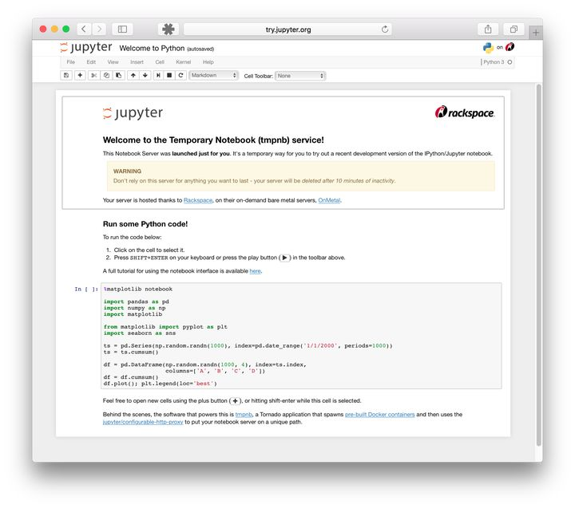
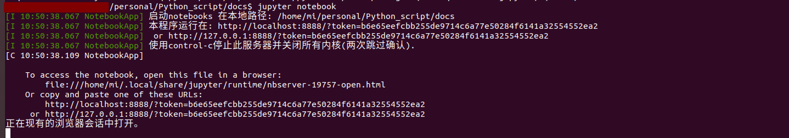
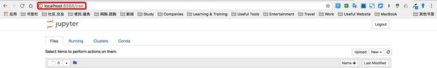
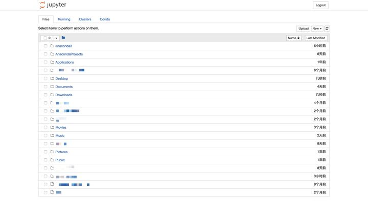
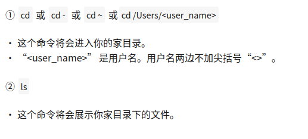

- 面向人群: 零基础或者初学者

- 难度: 简单， 属于Python基础课程

本小节用一个简单的股票数据读取与可视化的案例来巩固所学知识点。

前置学习:
- [【Python教程】Windows10安装Pycharm](https://mp.weixin.qq.com/s?__biz=MzkyMjE4NTA4OQ==&mid=2247483753&idx=1&sn=a3e3a566e71ebce401c15921b1b5a180&chksm=c1f97d87f68ef49145ff2326c65ece68d12d0d5d33e2b951bdc7910f4e5ea3fd29a79a5ef749&token=1122813144&lang=zh_CN#rd)
- [【Python教程】安装Anaconda](https://mp.weixin.qq.com/s?__biz=MzkyMjE4NTA4OQ==&mid=2247484159&idx=2&sn=a0c4361e08aa003d8e77296857d18bd1&chksm=c1f97e11f68ef707d56fccb88a8d5e32ce3c0995a9bde5d0cfe6ebb9fe4c336fe3f97eaff002&token=1122813144&lang=zh_CN#rd)
- [【Python 教程】Pycharm添加第三方库和插件](https://mp.weixin.qq.com/s?__biz=MzkyMjE4NTA4OQ==&mid=2247484180&idx=1&sn=31225b68ed56f7185590f5b4e3a37c60&chksm=c1f97ffaf68ef6ecf8730c810cebced49340bd017f24db5de8d1dbbc1674e543a0949e0c718f&token=1122813144&lang=zh_CN#rd)

Jupyter Notebook是Anaconda自带的一款非常不错的代码编辑器，非常适合Python初学者使用，它有如下特点：
- 可以非常方便地将代码分区块运行；
- 运行结果可以自动保存，不需要在之后重复运行代码；
- 可以直接在单个模块中通过输入变量名来打印和查看数据，便于调试代码；
- 因为是Anaconda自带的编辑器，所以无须配置运行环境；
- 相较于PyCharm而言，Jupyter Notebook的启动速度非常快，不过其自动查错功能及界面美观度稍逊于PyCharm。 
- 初次接触Jupyter Notebook时，会感觉其启动方式和打开文件的方式与PyCharm相比稍显麻烦，不过其启动速度非常快，熟悉之后就能方便地使用。
  



我们看到简而言之，Jupyter Notebook是以网页的形式打开，可以在网页页面中直接编写代码和运行代码，
代码的运行结果也会直接在代码块下显示的程序。如在编程过程中需要编写说明文档，可在同一个页面中直接编写，便于作及时的说明和解释。
下面就来讲解Jupyter Notebook的基本操作。

# 一、安装

如果你已经安装了Anaconda，请忽略此步，Anaconda环境内自带。

## ① 安装前提
安装Jupyter Notebook的前提是需要安装了Python（3.3版本及以上，或2.7版本）。
## ② 使用Anaconda安装
如果你是小白，那么建议你通过安装Anaconda来解决Jupyter Notebook的安装问题，因为Anaconda已经自动为你安装了Jupter Notebook及其他工具，还有python中超过180个科学包及其依赖项。
你可以通过进入Anaconda的官方下载页面自行选择下载；如果你对阅读英文文档感到头痛，或者对安装步骤一无所知，甚至也想快速了解一下什么是Anaconda，那么可以前往我的另一篇文章：
- [【Python教程】安装Anaconda](https://mp.weixin.qq.com/s?__biz=MzkyMjE4NTA4OQ==&mid=2247484159&idx=2&sn=a0c4361e08aa003d8e77296857d18bd1&chksm=c1f97e11f68ef707d56fccb88a8d5e32ce3c0995a9bde5d0cfe6ebb9fe4c336fe3f97eaff002&token=1122813144&lang=zh_CN#rd)
常规来说，安装了Anaconda发行版时已经自动为你安装了Jupyter Notebook的，但如果没有自动安装，那么就在终端（Linux或macOS的“终端”，Windows的“Anaconda Prompt”，以下均简称“终端”）中输入以下命令安装：
```
 conda install jupyter notebook 
````
  
## ③ 使用pip命令安装
如果你是有经验的Python玩家，想要尝试用pip命令来安装Jupyter
Notebook，那么请看以下步骤吧！接下来的命令都输入在终端当中的噢！

1. 把pip升级到最新版本

```Python 3.x
pip3 install --upgrade pip
Python 2.x
pip install --upgrade pip
```
   
注意：老版本的pip在安装Jupyter Notebook过程中或面临依赖项无法同步安装的问题。因此强烈建议先把pip升级到最新版本。
2. 安装Jupyter Notebook

```Python 3.x
pip3 install jupyter
Python 2.x
pip install jupyter
```
# 二、运行Jupyter Notebook

## 0. 帮助
如果你有任何jupyter notebook命令的疑问，可以考虑查看官方帮助文档，命令如下：

```jupyter notebook --help```
或

```jupyter notebook -h```

## 1. 启动
### ① 默认端口启动
在终端中输入以下命令：

```jupyter notebook```

执行命令之后，在终端中将会显示一系列notebook的服务器信息，同时浏览器将会自动启动Jupyter Notebook。

启动过程中终端显示内容如下：

```$ jupyter notebook
[I 08:58:24.417 NotebookApp] Serving notebooks from local directory: /Users/catherine
[I 08:58:24.417 NotebookApp] 0 active kernels
[I 08:58:24.417 NotebookApp] The Jupyter Notebook is running at: http://localhost:8888/
[I 08:58:24.417 NotebookApp] Use Control-C to stop this server and shut down all kernels (twice to skip c
```


> 注意：之后在Jupyter Notebook的所有操作，都请保持终端不要关闭，因为一旦关闭终端，就会断开与本地服务器的链接，你将无法在Jupyter Notebook中进行其他操作啦。

浏览器地址栏中默认地将会显示：http://localhost:8888。其中，“localhost”指的是本机，“8888”则是端口号。



如果你同时启动了多个Jupyter Notebook，由于默认端口“8888”被占用，因此地址栏中的数字将从“8888”起，每多启动一个Jupyter Notebook数字就加1，如“8889”、“8890”……

### ② 指定端口启动
如果你想自定义端口号来启动Jupyter Notebook，可以在终端中输入以下命令：

```jupyter notebook --port <port_number>```

其中，“<port_number>”是自定义端口号，直接以数字的形式写在命令当中，数字两边不加尖括号“<>”。如：
```jupyter notebook --port 9999```，即在端口号为“9999”的服务器启动

```Jupyter Notebook```


### ③ 启动服务器但不打开浏览器
如果你只是想启动Jupyter Notebook的服务器但不打算立刻进入到主页面，那么就无需立刻启动浏览器。在终端中输入：

```jupyter notebook --no-browser```

此时，将会在终端显示启动的服务器信息，并在服务器启动之后，显示出打开浏览器页面的链接。当你需要启动浏览器页面时，只需要复制链接，并粘贴在浏览器的地址栏中，轻按回车变转到了你的Jupyter Notebook页面。

# 2.主页面
## ① 主页面内容
当执行完启动命令之后，浏览器将会进入到Notebook的主页面，如下图所示。



如果你的主页面里边的文件夹跟我的不同，或者你在疑惑为什么首次启动里边就已经有这么多文件夹，不要担心，这里边的文件夹全都是你的家目录里的目录文件。你可以在终端中执行以下2步来查看：



## ② 设置Jupyter Notebook文件存放位置

如果你不想把今后在Jupyter Notebook中编写的所有文档都直接保存在家目录下，那你需要修改Jupyter Notebook的文件存放路径。m