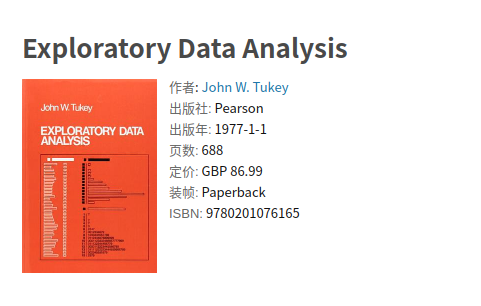
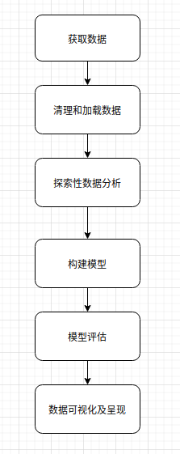

# 探索性数据分析(EDA)
## 1. 什么是EDA
探索性数据分析(Exploratory Data Analysis，简称EDA)，指对数据分析的过程中尽量不加入先验假设，而是通过作图表和统计等方式来探索数据结构和规律。

EDA最早由John W. Tukey在上世纪70年代被提出，最早用于统计学的科学实验的数据研究中。EDA现在已经是数据分析中重要的指导思路，从数据出发来寻找规律，而不是依靠人工假设。

在EDA中你可以构思各种各样的假设，并通过数据分析去寻找相应的反馈，以此迭代来寻找到数据集中分布的规律。在探索的过程中会随着不断的深入对数据理解更加深刻。

---
探索性数据分析(EDA)往往是在对数据建模之前，对数据的基本认识，主要从数据的一些简单的数据特征入手，通过独立性检验，假设检验并辅助以作图的方式对数据进行简单的分析， EDA往往是在做数据建模或机器学习时，必不可少的一步。

---
在统计学中，探索性数据分析（EDA）是一种分析数据集以总结其主要特征的方法，通常采用可视化的方法。可以使用或不使用统计模型，但主要是EDA用于查看数据在正式建模或假设检验任务之外可以告诉我们的内容。John Tukey促进了探索性数据分析，以鼓励统计人员探索数据，并可能制定可能导致新数据收集和实验的假设。EDA与初始数据分析（IDA）不同，更侧重于检查模型拟合和假设检验所需的假设，处理缺失值并根据需要进行变量转换。EDA包含IDA。

## EDA目标
> EDA旨在简化下游分析

EDA的目的是发现潜在的模式，发现异常，构筑假设并检查假设，以找到一个合适的模型（如果存在）

从更细粒度的角度来看,EDA涉及:

- 理解变量之间的关系，包括确定解释变量之间的关系；
- 评估解释变量和结果变量之间的关系（方向和粗略估计）
- 异常值的存在；
- 重要的解释变量的等级；
- 关于各个解释变量是否具有统计学意义的结论。

## 2. EDA流程

<b>EDA的流程如下：</b>

- 提出问题；
- 筛选、清洗数据；
- 分析数据；
- 构建模型；
- 得出结论；

EDA的过程与数据挖掘的流程不谋而合，特征是否起作用需要具体的分析和验证。从数据本身出发去寻找合适的特征

使用EDA完成数据分析的过程如下：

- 读取并分析数据质量；
- 探索性分析每个变量；
    - 变量是什么类型；
    - 变量是否有缺失值；
    - 变量是否有异常值；
    - 变量是否有重复值；
    - 变量是否均匀；
    - 变量是否需要转换；
- 探索性分析变量与target标签的关系；
    - 变量与标签是否存在相关性；
    - 变量与标签是否存在业务逻辑；
- 探索性分析变量之间的关系；
    - 连续型变量与连续型变量;
        - 可视化：散点图、相关性热力图；
        - 皮尔逊系数；
        - 互信息；
    - 离散变量与离散变量；
        - 可视化：柱状图、饼图、分组表；
        - 卡方检验；
    - 检查变量之间的正态性；
        - 直方图；
        - 箱线图；
        - Quantile-Quantile (QQ图)；
    

<b>根据EDA我们可以得出以下结论：</b>

- 变量是否需要筛选、替换和清洗；
- 变量是否需要转换；
- 变量之间是否需要交叉；
- 变量是否需要采样；

# 涉及的数据基础认识
## 数据类型

# 可参考案例
- https://www.kaggle.com/jolasa/eda-anda-data-preparation-4th-place?scriptVersionId=21118720
- https://www.kaggle.com/ekami66/detailed-exploratory-data-analysis-with-python
- Exploratory Data Analysis (EDA) prior to Machine Learning: https://ugoproto.github.io/ugo_py_doc/eda_machine_learning_feature_engineering_and_kaggle/

- E-Commerce-EDA-Kaggle: https://github.com/SavcOleg/E-Commerce-EDA-Kaggle/blob/master/E-Commerce-EDA.ipynb
# 参考资料
https://en.wikipedia.org/wiki/Exploratory_data_analysis