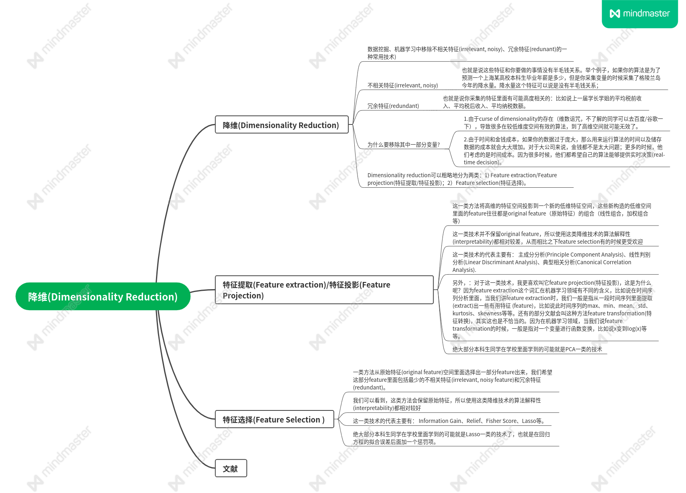
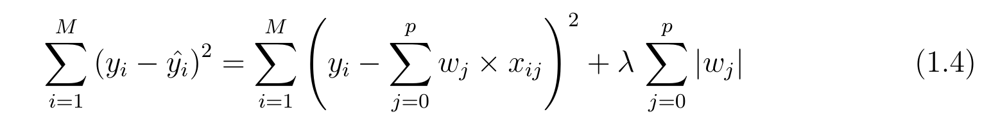

# 数据降维

# 特征选择
鉴于很多同学或者参考文献一开始就讲Filter、Wrapper、Embedding各种分类方法，我认为在讲这些分类方法之前，我们首先需要考虑以下几件事：

### 1）我们的算法是属于哪一类？ 

- Supervised(classification、regression)、
- unsupervised(clustering)、
- semi-supervised.
### 2)我们的特征空间属于哪一类：
- Flat features (也就是我们最常见的Dataset的情况，特征是静态的、而且彼此之间不存在特定的组织架构关系，结合后面两点对比来看就能理解);
  
- Structured Features（特征之间存在一定的组织架构关系），比如说 Group Structure（某些特征属于特定小组，若选则全都选、若不选则全都不要） 、Tree Structure （特征之间存在父子包含关系，若父特征被选中，则所有的子特征都会被选中）
  
- Streaming features （随着时间的变动，会采集新的特征）

### 3）最后才是考虑你喜欢哪一种Feature Selection方法：

- Filter方法: 这类方法将从Dataset的feature本身出发，考察变量之间的相关性(correlation)等，并不考虑做了feature selection之后你使用的特定算法。举个例子：如果说数据是有label的(我们的算法是classification)，并且我们的特征空间是flat feature，那么它可能会计算label和其它feature之间的相关性来找到relevant features; 然后再考察relevant features之间的相关性，来找到redundant features. 如果我们的数据是没有label(我们的算法是clustering)那么可能直接计算features之间的相关性，或者使用其它方法。这类方法其实是最基本的，但是在国内的统计学教科书上很少做相关介绍。比如说，我们可以使用Fisher score,    Mutual Information , Relief 等来衡量上述的correlation.
  
- Wrapper方法：这类方法在做feature selection的时候，先选出来一部分特征，然后将这部分特征用于运行你的特定算法（比如说决策树），看看表现如何；然后重复上述步骤，直到选出“最好的”特征子集为止。
  
- Embedding 方法：这一类方法的话，就是把feature selection这种思想在算法里built-in了，并不单独拎出来。举个例子：见下图，就lasso回归来说，在拟合误差项后面再给你整一项惩罚项来进行feature selection。

我们可以看到这就是built-in的思想，你无法将其单拎出来，而是“浑然天成“一体。再说一点题外话，在实际应用中，如果feature dimension过于庞大，一般都是使用filter方法；或者是使用filter方法进行预处理，剔除一批“劣质”特征，然后再使用Wrapper或者Embedding进行“精选”。

# 参考文献

- [0] Dash M, Liu H. Feature selection for classification[J]. Intelligent data analysis, 1997, 1(1-4): 131-156. (引用4086次)
- [1] Guyon I, Elisseeff A. An introduction to variable and feature selection[J]. Journal of machine learning research, 2003, 3(Mar): 1157-1182.  (引用16418次)
- [2] Dy J G, Brodley C E. Feature selection for unsupervised learning[J]. Journal of machine learning research, 2004, 5(Aug): 845-889. (引用1098次)
- [3] Alelyani S, Tang J, Liu H. Feature selection for clustering: a review[J]. Data clustering: algorithms and applications, 2013, 29(110-121): 144. (引用309次)
- [4] Tang J, Alelyani S, Liu H. Feature selection for classification: A review[J]. Data classification: Algorithms and applications, 2014: 37. (引用991次)
- [5] Chandrashekar G, Sahin F. A survey on feature selection methods[J]. Computers & Electrical Engineering, 2014, 40(1): 16-28. (引用2614次)
- [6] Li J, Cheng K, Wang S, et al. Feature selection: A data perspective[J]. ACM Computing Surveys (CSUR), 2017, 50(6): 1-45. (引用1024次）
- [7] Sheikhpour R, Sarram M A, Gharaghani S, et al. A survey on semi-supervised feature selection methods[J]. Pattern Recognition, 2017, 64: 141-158.  (引用252次）
- [8] AlNuaimi N, Masud M M, Serhani M A, et al. Streaming feature selection algorithms for big data: A survey[J]. Applied Computing and Informatics, 2019. (引用22次）
