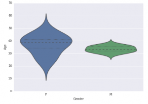

# 如何使用Python进行数据可视化

- 面向人群: 零基础或者初学者

- 难度: 简单， 属于Python基础课程


对于那些学习编程的人来说，Python是一种出色的语言，非常适合那些希望“完成工作”并且不花很多时间在样板代码上的人。

# 重要说明
我们尽力保证课程内容的质量以及学习难度的合理性，但即使如此，真正决定课程效果的，还是你的每一次思考和实践。


课程多数题目的解决方案都不是唯一的，这和我们在实际工作中的情况也是一致的。因此，我们的要求功能的实现，更是要多去思考不同的解决方案，评估不同方案的优劣，然后使用在该场景下最优雅的方式去实现。所以，我们列出的参考资料未必是实现需求所必须的。有的时候，实现题目的要求很简单，甚至参考资料里就有，但是背后的思考和亲手去实践却是任务最关键的一部分。在学习这些资料时，要多思考，多提问，多质疑。相信通过和小伙伴们的交流，能让你的学习事半功倍。

# 1.1 简介
如同艺术家们用绘画让人们更贴切的感知世界，数据可视化也能让人们更直观的传递数据所要表达的信息。
在本文中，我将介绍如何开始使用Python和matplotlib、seaborn两个库对数据进行可视化。 

# 1.2 任务
下面这个图表:


当然如果你把这张图表丢给别人，他们倒是也能看懂，但无法很直观的理解其中的信息，而且这种形式的图表看上去也比较 low，这个时候我们如果换成直观又美观的可视化图形，不仅能突显逼格，也能让人更容易的看懂数据。


下面我们就用上面这个简单的数据集作为例子，展示用 Python 做出9种可视化效果，并附有相关代码。
分别是
- 直方图
- 箱线图
- 小提琴图
- 条形图
- 折线图
- 堆叠柱状图
- 散点图
- 气泡图
- 饼状图
- 热力图
# 1.3 知识点
- Linux命令行的使用
- Python基础
- matplotlib、seaborn两个库的简单使用

# .14 环境
- linux系统(ubuntu18.04)/ windows系统可以打开ubuntu子系统
- pycharm编辑器(windows如何安装pycharm社区版本)
- Python 3.6.9(windows如何安装python环境)
- pip3 9.0.1
- Matplotlib 3.3.3：基于Python的绘图库，提供完全的 2D 支持和部分 3D 图像支持。在跨平台和互动式环境中生成高质量数据时，matplotlib 会很有帮助。也可以用作制作动画。
  - 官方文档： https://matplotlib.org/
- Seaborn：该 Python 库能够创建富含信息量和美观的统计图形。Seaborn 基于 matplotlib，具有多种特性，比如内置主题、调色板、可以可视化单变量数据、双变量数据，线性回归数据和数据矩阵以及统计型时序数据等，能让我们创建复杂的可视化图形。
  - 官方文档: http://seaborn.pydata.org/

```bash
$ python --version
Python 3.6.9

$ pip3 --version
pip 9.0.1 from /usr/lib/python3/dist-packages (python 3.6)
```
#### windows系统：
（1）Win+R，输入cmd，打开Windows的命令行。
（2）输入：pip install Matplotlib、Seaborn，等待安装完成。 如果安装过程不顺利，请百度找到原因，直到安装成功为止
#### linux系统：
pip3 安装Matplotlib、Seaborn

```bash
pip3 install matplotlib -i https://pypi.tuna.tsinghua.edu.cn/simple
pip3 install seaborn
```
安装完后，你可以使用 python -m pip list 命令来查看是否安装了 matplotlib 模块。

```bash
$ pip3 list | grep matplotlib
matplotlib        3.3.3  
```


# 1.5 代码

导入数据集


```python
import matplotlib.pyplot as plt
import pandas as pd
df=pd.read_excel("data/First.xlsx", "Sheet1")
```


可视化为直方图
```python
fig=plt.figure() #Plots in matplotlib reside within a figure object, use plt.figure to create new figure
#Create one or more subplots using add_subplot, because you can't create blank figure
ax = fig.add_subplot(1,1,1)
#Variable
ax.hist(df['Age'],bins = 7) # Here you can play with number of bins
Labels and Tit
plt.title('Age distribution')
plt.xlabel('Age')
plt.ylabel('#Employee')
plt.show()
```


可视化为箱线图
```python
import matplotlib.pyplot as plt
import pandas as pd
fig=plt.figure()
ax = fig.add_subplot(1,1,1)
#Variable
ax.boxplot(df['Age'])
plt.show()

```


可视化为小提琴图
```python
import seaborn as sns 
sns.violinplot(df['Age'], df['Gender']) #Variable Plot
sns.despine()

```


可视化为条形图
```python
var = df.groupby('Gender').Sales.sum() #grouped sum of sales at Gender level
fig = plt.figure()
ax1 = fig.add_subplot(1,1,1)
ax1.set_xlabel('Gender')
ax1.set_ylabel('Sum of Sales')
ax1.set_title("Gender wise Sum of Sales")
var.plot(kind='bar')


```


可视化为折线图
```python
var = df.groupby('BMI').Sales.sum()
fig = plt.figure()
ax1 = fig.add_subplot(1,1,1)
ax1.set_xlabel('BMI')
ax1.set_ylabel('Sum of Sales')
ax1.set_title("BMI wise Sum of Sales")
var.plot(kind='line')

```


可视化为堆叠柱状图
```python
var = df.groupby(['BMI','Gender']).Sales.sum()
var.unstack().plot(kind='bar',stacked=True,  color=['red','blue'], grid=False)

```


可视化为散点图

```python
fig = plt.figure()
ax = fig.add_subplot(1,1,1)
ax.scatter(df['Age'],df['Sales']) #You can also add more variables here to represent color and size.
plt.show()

```


可视化为气泡图

```python
fig = plt.figure()
ax = fig.add_subplot(1,1,1)
ax.scatter(df['Age'],df['Sales'], s=df['Income']) # Added third variable income as size of the bubble
plt.show()
```


可视化为饼状图

```python
var=df.groupby(['Gender']).sum().stack()
temp=var.unstack()
type(temp)
x_list = temp['Sales']
label_list = temp.index
pyplot.axis("equal") #The pie chart is oval by default. To make it a circle use pyplot.axis("equal")
#To show the percentage of each pie slice, pass an output format to the autopctparameter 
plt.pie(x_list,labels=label_list,autopct="%1.1f%%") 
plt.title("Pastafarianism expenses")
plt.show()
```


可视化为热力图
```python

import numpy as np
#Generate a random number, you can refer your data values also
data = np.random.rand(4,2)
rows = list('1234') #rows categories
columns = list('MF') #column categories
fig,ax=plt.subplots()
#Advance color controls
ax.pcolor(data,cmap=plt.cm.Reds,edgecolors='k')
ax.set_xticks(np.arange(0,2)+0.5)
ax.set_yticks(np.arange(0,4)+0.5)
# Here we position the tick labels for x and y axis
ax.xaxis.tick_bottom()
ax.yaxis.tick_left()
#Values against each labels
ax.set_xticklabels(columns,minor=False,fontsize=20)
ax.set_yticklabels(rows,minor=False,fontsize=20)
plt.show()

```


你也可以自己试着根据两个变量比如性别（X 轴）和 BMI（Y 轴）绘出热度图。


### 小结

这里我们分享了如何利用 Python 及 matplotlib 和 seaborn 库制作出多种多样的可视化图形。通过上面的例子，我们应该可以感受到利用可视化能多么美丽的展示数据。而且和其它语言相比，使用 Python 进行可视化更容易简便一些。

# 拓展
下次我们讲解下Matplotlib的具体使用
