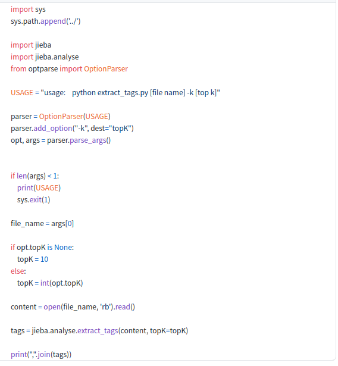
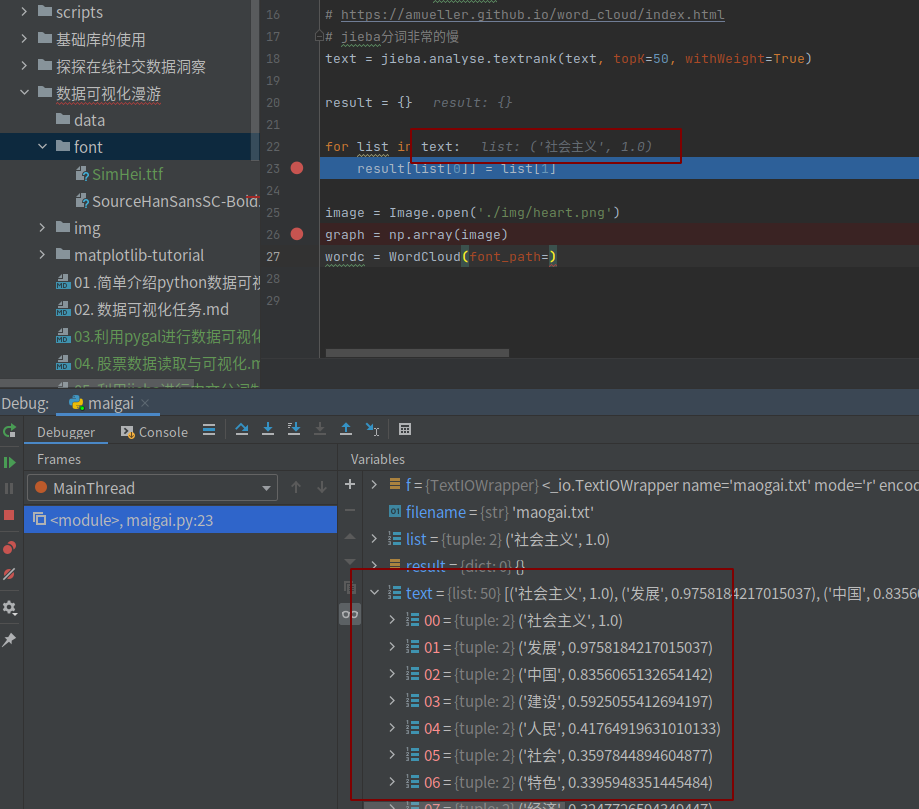
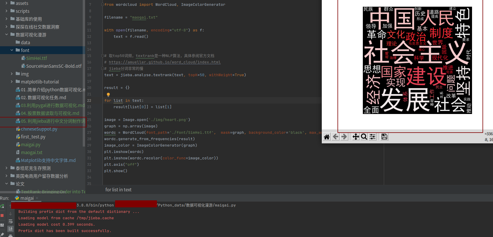
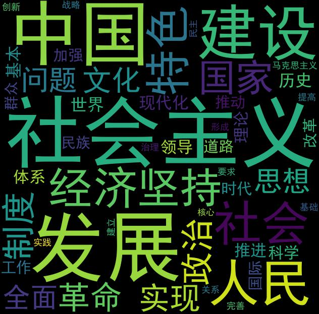

#! https://zhuanlan.zhihu.com/p/367034176

“词云”：是对网络文本中出现频率较高的“关键词”予以视觉上的突出，形成“关键词云层”或“关键词渲染”，从而过滤掉大量的文本信息，使浏览网页者只要一眼扫过文本就可以领略文本的主旨。
# 准备工作
- 抓取数据存到txt文档中 `maogai.txt`
- 了解jieba分词: https://github.com/fxsjy/jieba

# 安装

- 词云库（wordcloud）：pip install wordcloud

- 词文分割库（jieba）：pip install jieba

# 基于 TF-IDF 算法的关键词抽取
`import jieba.analyse`

- jieba.analyse.extract_tags(sentence, topK=20, withWeight=False, allowPOS=())
    - sentence 为待提取的文本
    - topK 为返回几个 TF/IDF 权重最大的关键词，默认值为 20
    - withWeight 为是否一并返回关键词权重值，默认值为 False
    - allowPOS 仅包括指定词性的词，默认值为空，即不筛选
- jieba.analyse.TFIDF(idf_path=None) 新建 TFIDF 实例，idf_path 为 IDF 频率文件

代码示例 （关键词提取）

https://github.com/fxsjy/jieba/blob/master/test/extract_tags.py


# 基于 TextRank 算法的关键词抽取

- jieba.analyse.textrank(sentence, topK=20, withWeight=False, allowPOS=('ns', 'n', 'vn', 'v')) 直接使用，接口相同，注意默认过滤词性。
- jieba.analyse.TextRank() 新建自定义 TextRank 实例

我们看下TextRank函数返回的数据：



算法论文： [TextRank: Bringing Order into Texts](http://web.eecs.umich.edu/~mihalcea/papers/mihalcea.emnlp04.pdf)
http://web.eecs.umich.edu/~mihalcea/papers/mihalcea.emnlp04.pdf

<b>基本思想</b>:
- 将待抽取关键词的文本进行分词
- 以固定窗口大小(默认为5，通过span属性调整)，词之间的共现关系，构建图
- 计算图中节点的PageRank，注意是无向带权图
使用示例:
见 test/demo.py
  
```python
#encoding=utf-8
from __future__ import unicode_literals
import sys
sys.path.append("../")

import jieba
import jieba.posseg
import jieba.analyse

print('='*40)
print('1. 分词')
print('-'*40)

seg_list = jieba.cut("我来到北京清华大学", cut_all=True)
print("Full Mode: " + "/ ".join(seg_list))  # 全模式

seg_list = jieba.cut("我来到北京清华大学", cut_all=False)
print("Default Mode: " + "/ ".join(seg_list))  # 默认模式

seg_list = jieba.cut("他来到了网易杭研大厦")
print(", ".join(seg_list))

seg_list = jieba.cut_for_search("小明硕士毕业于中国科学院计算所，后在日本京都大学深造")  # 搜索引擎模式
print(", ".join(seg_list))

print('='*40)
print('2. 添加自定义词典/调整词典')
print('-'*40)

print('/'.join(jieba.cut('如果放到post中将出错。', HMM=False)))
#如果/放到/post/中将/出错/。
print(jieba.suggest_freq(('中', '将'), True))
#494
print('/'.join(jieba.cut('如果放到post中将出错。', HMM=False)))
#如果/放到/post/中/将/出错/。
print('/'.join(jieba.cut('「台中」正确应该不会被切开', HMM=False)))
#「/台/中/」/正确/应该/不会/被/切开
print(jieba.suggest_freq('台中', True))
#69
print('/'.join(jieba.cut('「台中」正确应该不会被切开', HMM=False)))
#「/台中/」/正确/应该/不会/被/切开

print('='*40)
print('3. 关键词提取')
print('-'*40)
print(' TF-IDF')
print('-'*40)

s = "此外，公司拟对全资子公司吉林欧亚置业有限公司增资4.3亿元，增资后，吉林欧亚置业注册资本由7000万元增加到5亿元。吉林欧亚置业主要经营范围为房地产开发及百货零售等业务。目前在建吉林欧亚城市商业综合体项目。2013年，实现营业收入0万元，实现净利润-139.13万元。"
for x, w in jieba.analyse.extract_tags(s, withWeight=True):
    print('%s %s' % (x, w))

print('-'*40)
print(' TextRank')
print('-'*40)

for x, w in jieba.analyse.textrank(s, withWeight=True):
    print('%s %s' % (x, w))

print('='*40)
print('4. 词性标注')
print('-'*40)

words = jieba.posseg.cut("我爱北京天安门")
for word, flag in words:
    print('%s %s' % (word, flag))

print('='*40)
print('6. Tokenize: 返回词语在原文的起止位置')
print('-'*40)
print(' 默认模式')
print('-'*40)

result = jieba.tokenize('永和服装饰品有限公司')
for tk in result:
    print("word %s\t\t start: %d \t\t end:%d" % (tk[0],tk[1],tk[2]))

print('-'*40)
print(' 搜索模式')
print('-'*40)

result = jieba.tokenize('永和服装饰品有限公司', mode='search')
for tk in result:
    print("word %s\t\t start: %d \t\t end:%d" % (tk[0],tk[1],tk[2]))
```

- 词性标注


# 代码
```python
# import jieba
from os import path
import jieba.analyse
import wordcloud
from PIL import Image, ImageSequence
import numpy as np
import matplotlib.pyplot as plt
from wordcloud import WordCloud, ImageColorGenerator

filename = "maogai.txt"

with open(filename, encoding="utf-8") as f:
    text = f.read()


# 取top50词频，textrank是一种NLP算法，具体参阅官方文档
# https://amueller.github.io/word_cloud/index.html
# jieba分词非常的慢
text = jieba.analyse.textrank(text, topK=50, withWeight=True)

result = {}

for list in text:
    result[list[0]] = list[1]

image = Image.open('./img/heart.png')
graph = np.array(image)
wordc = WordCloud(font_path='./font/SimHei.ttf',  mask=graph, background_color='black', max_words=50, width=1920, height=1080)

# generate word cloud
wordc.generate_from_frequencies(result)
image_color = ImageColorGenerator(graph)

# store to file
wordc.to_file(path.join(d, "mi_result.jpg"))
plt.imshow(wordc)
plt.imshow(wordc.recolor(color_func=image_color))
plt.axis("off")
plt.show()


```

输出结果



# 问题

- wordcloud自身不支持中文词云，需要指定中文字体，并且现在大部分的博客提供的generate_from_frequencies方法的参数与现在的wordcloud的参数不同，现在这个方法接收的是dict类型
- ieba分词分的不太准确，比如机器学习会被切成机器和学习两个词，使用自定义词典，原本的想法是只切出自定义词典里的词，但实际上不行，所以可以根据jieba分词结果提取出高频词并自行添加部分词作为词典，切词完毕只统计自定义词典里出现过的词。这点在代码里没有实现，感兴趣的同学可以搜索研究下怎么实现
