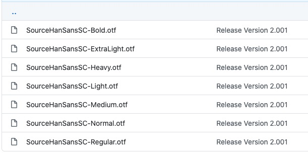
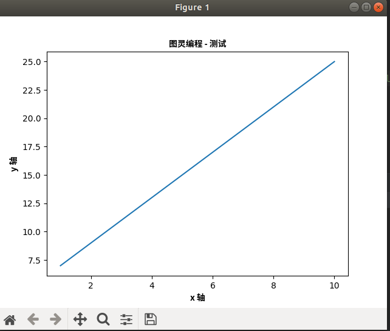

Matplotlib 默认情况不支持中文，我们可以使用以下简单的方法来解决。

这里我们使用思源黑体，思源黑体是 Adobe 与 Google 推出的一款开源字体。

官网：https://source.typekit.com/source-han-serif/cn/

GitHub 地址：https://github.com/adobe-fonts/source-han-sans/tree/release/OTF/SimplifiedChinese

打开链接后，在里面选一个就好了：

你也可以在网盘下载: https://pan.baidu.com/s/14cRhgYvvYotVIFkRVd71fQ 提取码: e15r。

可以下载个 OTF 字体，比如 SourceHanSansSC-Bold.otf，将该文件文件放在当前执行的代码文件中：

SourceHanSansSC-Bold.otf 文件放在当前执行的代码文件中：

```python
import numpy as np 
from matplotlib import pyplot as plt 
import matplotlib
 
# fname 为 你下载的字体库路径，注意 SourceHanSansSC-Bold.otf 字体的路径
zhfont1 = matplotlib.font_manager.FontProperties(fname="SourceHanSansSC-Bold.otf") 
 
x = np.arange(1,11) 
y =  2  * x +  5 
plt.title("图灵编程 - 测试", fontproperties=zhfont1) 
 
# fontproperties 设置中文显示，fontsize 设置字体大小
plt.xlabel("x 轴", fontproperties=zhfont1)
plt.ylabel("y 轴", fontproperties=zhfont1)
plt.plot(x,y) 
plt.show()
```
执行输出结果如下图：



# 更多
https://www.runoob.com/numpy/numpy-matplotlib.html

