# 泰坦尼克生存预测(Titanic Survival Prediction)
- 面向人群: 有一定python语言基础、机器学习基础

- 难度: 中等， 属于Python进阶课程


对于那些学习编程的人来说，Python是一种出色的语言，非常适合那些希望“完成工作”并且不花很多时间在样板代码上的人。

# 重要说明
我们尽力保证课程内容的质量以及学习难度的合理性，但即使如此，真正决定课程效果的，还是你的每一次思考和实践。


课程多数题目的解决方案都不是唯一的，这和我们在实际工作中的情况也是一致的。因此，我们的要求功能的实现，更是要多去思考不同的解决方案，评估不同方案的优劣，然后使用在该场景下最优雅的方式去实现。所以，我们列出的参考资料未必是实现需求所必须的。有的时候，实现题目的要求很简单，甚至参考资料里就有，但是背后的思考和亲手去实践却是任务最关键的一部分。在学习这些资料时，要多思考，多提问，多质疑。相信通过和小伙伴们的交流，能让你的学习事半功倍。

# 1 简介

## 1.1 关于kaggle竞赛

Kaggle是一个数据分析建模的应用竞赛平台，有点类似KDD-CUP（国际知识发现和数据挖掘竞赛），企业或者研究者可以将问题背景、数据、期望指标等发布到Kaggle上，以竞赛的形式向广大的数据科学家征集解决方案。而热爱数(dong)据(shou)挖(zhe)掘(teng)的小伙伴们可以下载/分析数据，使用统计/机器学习/数据挖掘等知识，建立算法模型，得出结果并提交，排名top的可能会有奖金哦！
## 1.2 kaggle竞赛模式
Kaggle上的竞赛有各种分类，例如奖金极高竞争激烈的的 “Featured”，相对平民化的 “Research”等等。但他们整体的项目模式是一样的，就是通过出题方给予的训练集建立模型，再利用测试集算出结果用来评比。

同时，每个进行中的竞赛项目都会显示剩余时间、参与的队伍数量以及奖金金额，并且还会实时更新选手排位。在截止日期之前，所有队伍都可以自由加入竞赛，或者对已经提交的方案进行完善，因此排名也会不断变动，不到最后一刻谁都不知道花落谁家。

由于这类问题并没有标准答案，只有无限逼近最优解，所以这样的模式可以激励参与者提出更好的方案，甚至推动整个行业的发展。

Kaggle竞赛另一个有趣的地方在于每个人都有自己的Profile，上面会显示所有自己参与过的项目、活跃度、实时排位、历史最佳排位等，不仅看上去非常有成就感，更能在求职和申请的时候起到Certificate的作用。
## 1.3 项目介绍

带大家去该问题页面溜达一圈吧
- https://www.kaggle.com/c/titanic

<b>下面是问题背景页</b>
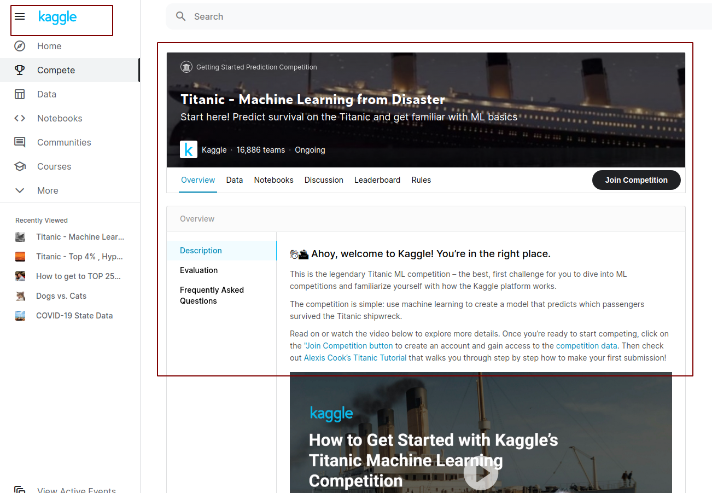
<b>下面是可下载数据Data的页面</b>
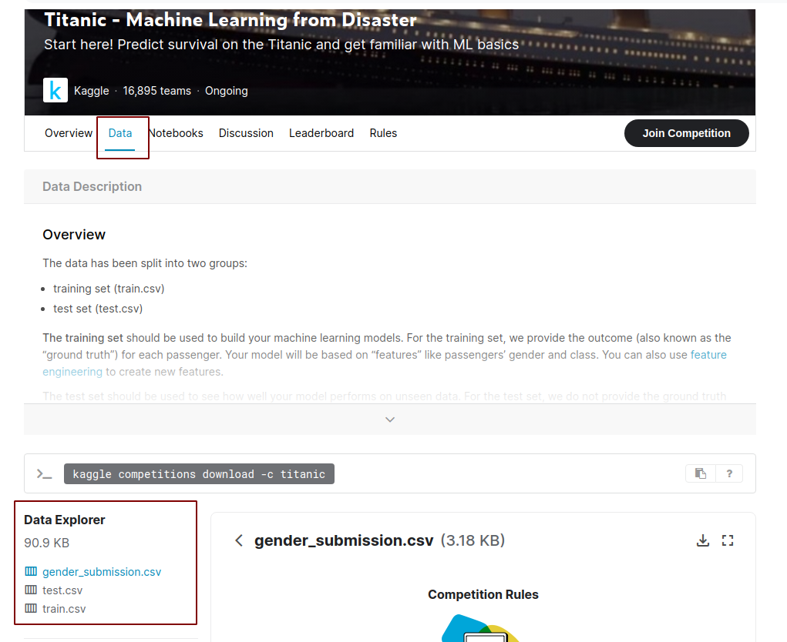

<b>泰坦尼克号问题之背景</b>

- 就是那个大家都熟悉的『Jack and Rose』的故事，豪华游艇倒了，大家都惊恐逃生，可是救生艇的数量有限，无法人人都有，副船长发话了『lady and kid first！』，所以是否获救其实并非随机，而是基于一些背景有rank先后的。

- 训练和测试数据是一些乘客的个人信息以及存活状况，要尝试根据它生成合适的模型并预测其他人的存活状况。

- 对，这是一个二分类问题，是我们之前讨论的logistic regression所能处理的范畴。

在这个项目中，我们试图为生存预测创建最佳模型。我们可以尝试了各种不同的预处理方式，填充缺失值，模型训练和超参数调整.
我将介绍我在该项目中所做的所有工作，以及为获得更好的预测结果所做的更改。

# 2 基础知识讲解

## 2.1 机器学习
机器学习的本质是用机器取代人直接做决策，如淘宝推荐、歌曲推荐、电影推荐。通过机器学习算法 + 训练数据（如你的浏览记录、听歌记录等）得到一个机器学习模型，用该模型预测想买的东西、想听的歌曲、想看的电影等。


机器学习算法就是将人类决策思考的过程抽象成模型，用数学的方法给这个模型找到最优解，在将解变成机器可以执行的命令，完成机器大脑（算法）的构建。

机器学习分为三层:

- 1）基础层，用云计算重组海量数据，为人工智能的实现提供基础的后台保障，是大前提。

- 2）技术层，各种处理数据的机器学习算法。

- 3）应用层，具体应用如Google搜索、无人驾驶、智能医疗等。

以Google搜索为例:

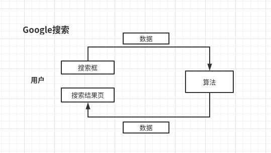

搜索过程：

1）当我们在搜索框输入：关键词

2）搜索结果页：结果搜索列表，该列表以相关性大小排序

3）点击列表中的某页面

解析：

搜索框和搜索结果页面完成了实时的客户反馈。出现搜索结果列表后，你越往下点，越表明搜索结果的相关性越差，你的每一次点击都在帮助Google训练它的机器学习算法和优化决策过程。

若Google使用传统的方式询问客户的哪里满意和不满意，效率太低了。因此机器学习的反馈闭环必须是业务天然的有机部分，使用客户行为留下来的历史数据帮助机器学习，优化机器学习的决策过程。

## 2.2 机器学习的具体步骤
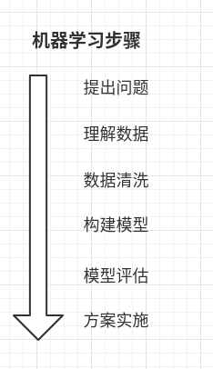

1、提出问题

一切数据分析、机器学习目标都是为了解决实际工作和生活中的具体问题。通过历史听歌数据预测他可能喜欢哪首歌，从而达到个性化推荐。

明确的问题回味后续分析提供方向。


2、理解数据

1）采集数据

2）导入数据

3）查询数据信息


3、清洗数据集

1）数据预处理

对数据整容，弄成我们想要的样子如缺失值处理、数据类型的转化等，具体如下：

选择子集

列名重命名

缺失数据处理

数据类型转化

数据排序

异常值处理


2）特征工程

最大限度的从原始数据中提取特以供机器学习算法和模型使用。

从原始数据中提取出来的特征好坏会直接影响到模型的效果。有时可以使用不是最有的机器学习算法来训练数据，如果特征选择不错的话，依然可以得到不错的结果。所以特征工程就是最大限度的从原始数据中提取特征供机器学习算法和模型使用。

提取特征：

我们需要和熟悉业务逻辑的人沟通，将业务部门说的这些特征反应到我们构建的代码中，并通过实验不断尝试，产生新的特征。

4、构建模型

用训练数据构建模型，将上面的特征放入某

机器学习算法中

5、模型评估

用测试数评估，看模型的预测效果如何

6、方案实施

将分析结果撰写报告进行汇报，kaggle项目需要将预测结果提交个kaggle,查询自己的排名。

## 2.3 泰坦尼克号生存预测
### 目录
- 提出问题
- 理解数据
- 数据处理（数据预处理and特征工程）
- 模型构建与评估
- 总结

### 任务计划

我们将研究学习以下内容：

- 数据可视化(Data visualization)
- 数据预处理(Data Preprocessing)
- 填写缺失值(Filling in missing values)
- 编码方式(Encoding)

----
### (1) 提出问题
什么样的人在泰坦尼克号中更容易存活？
### (2) 理解数据
**先初步了解一下变量个数、数据类型、分布情况、缺失情况等，并做出一些猜想。**
#### 采集数据

从Kaggle泰坦尼克号项目页面下载数据：
- train.csv: Kaggle泰坦尼克号项目给的训练数据集，做为我们的原始数据集记为source
- test.csv: Kaggle泰坦尼克号项目给我们的测试数据，叫做预测数据集记为pred

#### 导入数据

```python
# 忽略警告提示
import warnings
warnings.filterwarnings('ignore')

# 导入处理数据包
import numpy as np # 用于科学计算
import pandas as pd # 用于数据分析
# 导入训练数据和测试数据,并将它们合并方便对两个数据清洗
train_data = pd.read_csv('../data/train.csv')
print(train_data)
```

pandas是常用的python数据处理包，把csv文件读入成dataframe格式，我们在ipython notebook中，看到data_train如下所示：
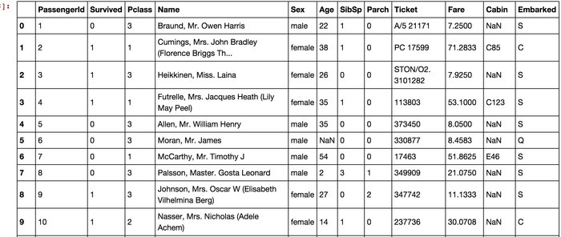
这就是典型的dataframe格式，如果你没接触过这种格式，完全没有关系，你就把它想象成Excel里面的列好了。
我们看到，总共有12列，其中Survived字段表示的是该乘客是否获救，其余都是乘客的个人信息，包括：

- PassengerId => 乘客ID
- Pclass => 乘客等级(1/2/3等舱位)
- Name => 乘客姓名
- Sex => 性别
- Age => 年龄
- SibSp => 堂兄弟/妹个数
- Parch => 父母与小孩个数
- Ticket => 船票信息
- Fare => 票价
- Cabin => 客舱
- Embarked => 登船港口


#### 查看数据集信息
我们先概览下数据，训练集字段：乘客ID、是否生存、舱位等级、姓名、性别、年龄、堂兄弟和堂兄妹个数、父母和孩子的个数、船票编码、票价、客舱、上船口岸。
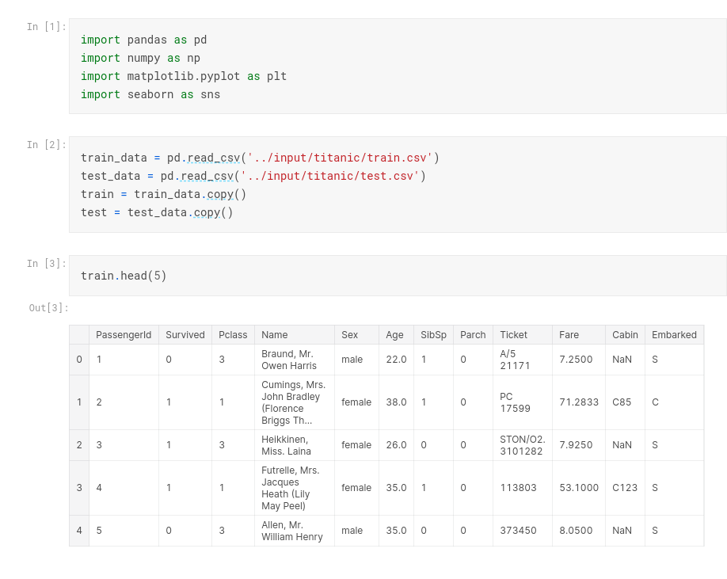
随机查看测试集的数据, 与训练集相比，少了目标变量Survived，其余字段都是一样的。
```python
#随机查看测试集的数据
test.sample(6)
```
```python
train.info()
print("==" * 50)
test.info()
```
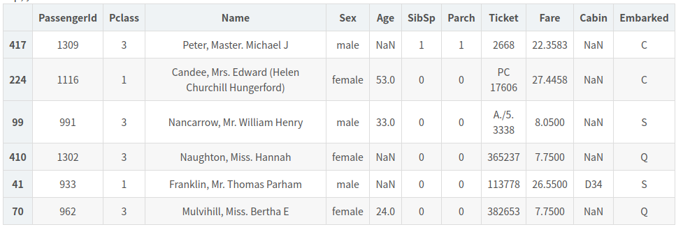

全量数据,逐条往下看，要看完这么多条，眼睛都有一种要瞎的赶脚。好吧，我们让dataframe自己告诉我们一些信息，如下所示：

```python

train_data.info()
```
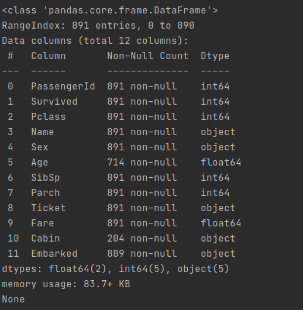


我们发现有一些列，比如说Carbin，有非常多的缺失值
另外一些我们感觉在此场景会影像的属性，比如Age,也有缺失值

上面的数据说啥了？它告诉我们，训练数据中总共有891名乘客，但是很不幸，我们有些属性的数据不全（具体可看下面的缺失值），比如说：

- Age（年龄）属性只有714名乘客有记录
- Cabin（客舱）更是只有204名乘客是已知的
似乎信息略少啊，想再瞄一眼具体数据数值情况呢？恩，我们用下列的方法，得到数值型数据的一些分布(因为有些属性，比如姓名，是文本型；而另外一些属性，比如登船港口，是类目型。这些我们用下面的函数是看不到的)：

```python
#查看数值型数据情况：
data_train.describe()
```
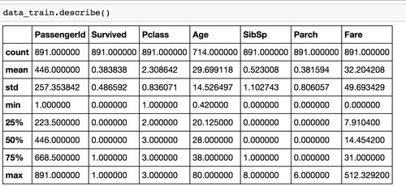
我们从上面看到更进一步的什么信息呢？
mean字段告诉我们，大概0.383838的人最后获救了，2/3等舱的人数比1等舱要多，平均乘客年龄大概是29.7岁(计算这个时候会略掉无记录的)等等…
```python
#查看字符型数据情况：
train.describe(include=['O'])
```
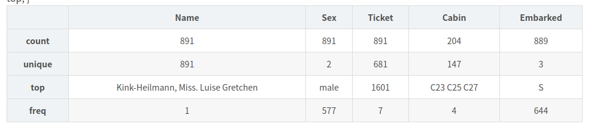

#### 数据初步分析
> 『对数据的认识太重要了！』

数值看花眼了。我们还是统计统计，画些图来看看属性和结果之间的关系好了，代码如下：

```python
#!/usr/bin/env python
# -*- coding: utf-8 -*-
# @Time : 2020/12/24
# @Author : AlexZ33
# @Site :  https://blog.csdn.net/error404404/article/details/81669929
# https://blog.csdn.net/error404404/article/details/81669929
# https://blog.csdn.net/aicanghai_smile/article/details/79234172
# @Reference: https://www.kaggle.com/tanmayunhale/titanic-top-4-hyperparameter-tuning
# @File : tatanic.py
# @Software: PyCharm
# 忽略警告提示
import warnings
warnings.filterwarnings('ignore')

# 导入处理数据包
import numpy as np
import pandas as pd
import matplotlib.pyplot as plt
import matplotlib
import seaborn as sns

# fname 为 你下载的字体库路径，注意 SourceHanSansSC-Bold.otf 字体的路径
zhfont1 = matplotlib.font_manager.FontProperties(fname="./font/SourceHanSansSC-Bold.otf")

# 导入训练数据和测试数据,并将它们合并方便对两个数据清洗
train_data = pd.read_csv('./data/train.csv')
# print(train_data)
train_data.info()
print(train_data.info())

test_data = pd.read_csv('./data/train.csv')
train = train_data.copy()
test = test_data.copy()

fig = plt.figure()
fig.set(alpha = 0.2)  # 设定图表颜色alpha参数

# 2行３列的图标, [0,0]位置
plt.subplot2grid((2,3), (0,0)) # 在一张大图里分列几个小图
train.Survived.value_counts().plot(kind="bar") # 柱状图
plt.title(u"获救情况 (1为获救)", fontproperties=zhfont1) # 标题
plt.ylabel(u"人数", fontproperties=zhfont1)


plt.subplot2grid((2,3),(0,1))
train.Pclass.value_counts().plot(kind="bar")
plt.ylabel(u"人数", fontproperties=zhfont1)
plt.title(u"乘客等级分布", fontproperties=zhfont1)

plt.subplot2grid((2,3),(0,2))
plt.scatter(train.Survived, train.Age)
plt.ylabel(u"年龄", fontproperties=zhfont1)                         # 设定纵坐标名称
plt.grid(b=True, which='major', axis='y')
plt.title(u"按年龄看获救分布 (1为获救)", fontproperties=zhfont1)

plt.subplot2grid((2,3),(1,0), colspan=2)
train.Age[train.Pclass == 1].plot(kind='kde')
train.Age[train.Pclass == 2].plot(kind='kde')
train.Age[train.Pclass == 3].plot(kind='kde')
plt.xlabel(u"年龄", fontproperties=zhfont1)# plots an axis lable
plt.ylabel(u"密度", fontproperties=zhfont1)
plt.title(u"各等级的乘客年龄分布", fontproperties=zhfont1)
plt.legend((u'头等舱', u'2等舱',u'3等舱'),loc='best', prop=zhfont1) # sets our legend for our graph.

plt.subplot2grid((2,3),(1,2))
train.Embarked.value_counts().plot(kind='bar')
plt.title(u"各登船口岸上船人数", fontproperties=zhfont1)
plt.ylabel(u"人数", fontproperties=zhfont1)

plt.show()


```

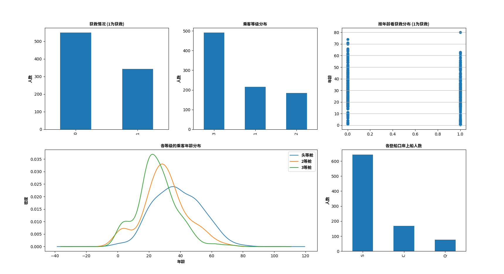


**A.基本描述**

- 类别型变量：Survived、Pclass（顺序）、Sex、Embarked。
- 数值型变量：Age、 SibSp（离散）、Parch（离散）、Fare.

总共4个字段有缺失，缺失程度不一样（Age、Cabin缺较多，Fare、Embarked缺较少）

训练集中(train_data)：

- （1）共有891名乘客，生存率为38%
- （2）年龄最小为0.42，最大为80岁，除去缺失值，平均年龄为29，高龄人士较少
- （3）约25%的乘客有一个或以上的兄弟姐妹陪伴的，75%以上的乘客没有与父母孩子同行
- （4）票价平均值在32美元，最高值在512美元，差距较大
- （5）每个人的名字都是无重复的
- （6）男性共计577人，男乘客较女乘客多
- （7）Ticket有681个不同的值
- （8）Cabin的数据缺失较多，891人中有记录的仅为204人
- （9）上船口岸有缺失值，644人在S港口上船，占比较大

**B.猜想：**

现已知目标变量为Survived，其余都作为建模可供考虑的特征。下面我们要探究一下现有的每一个变量对乘客生存的影响程度，有用的留下，没用的删除，也看能不能发掘出新的信息帮助构建模型。可做出以下猜想：

- 1.Pclass、Fare反映一个人的身份、财力情况，在危难关头，社会等级高的乘客的生存率比等级低的乘客的生存率高。

- 2.在灾难发生时，人类社会的尊老爱幼、女性优先必会起作用。故老幼、女性生存率更高。

- 3.有多个亲人同行的话，人多力量大，生存率可能更高些。

- 4.名字、Ticket看不出能反映什么，可能会删掉。

- 5.Id在记录数据中有用，在分析中没什么用，删掉。

**C:缺失数据：**

<b>对于缺失的数据，需要根据不同情况进行处理。</b>

处理缺失值方式(在scikit-learn中，build models时若有缺失值会报错）：

- 删（简单粗暴，dropna）
    - 完整实例删除，即删行（简单粗暴，当样本量大，且缺失案例较少时用）
    - 删除有缺失值的特征（该列缺失严重，且该特征对建模效果影响不大时用）
- Imputation（从已知的部分数据中推断出缺失值，虽然估计值并不绝对百正确，但是比上述删除列的做法来说，此法建模效果更好一点）
    - 用该特征的均值、中位数、众数等去估算（普通版）
    - 由其他已知的数值型数据，去估算缺失值的值（进阶版）
  
> 对这些缺损的数据可以选择的处理方式由简到难包括：(这几种方法具体使用哪一个需要根据实际情况决定，选用复杂的方法得到的结果不一定就好。)
> - 1.直接删除此特征（缺损数据太多的情况，防止引入噪声）
> - 2.直接删除缺损数据的样本（~土豪操作~只用于训练数据集，且样本量较大，缺损数据样本较少的情况）
> - 3.直接将有无数值作为新的特征（数据缺失较多，且数据有无本身是对预测是一个有用的特征）
> - 4.中值或均值回补（缺失数据较多，不想损失此较多训练数据，特征又比较重要的情况，是比较常用的方法）
> - 5.参考其他特征，利用与此特征的相关性编写算法回补数据（~大神级操作~回补的准确性可能会比较高一些，但实现过程复杂）

**D.数据类型转换：**

字符型都要转换成数值型数据。
再来观察这11个特征的类型，其中有4个特征，包括：'PassengerId'，'Pclass’,'Sibsp'，'Parch'属于整数型数据，5个特征，包括：'Name'，'Sex'，'Ticket'，'Cabin'，'Embarked'属于字符串类型数据，2个特征，包括：'Age'，'Fare'属于浮点数。然而这些数据格式并不都是机器学习模型的菜，你直接喂给模型字符串数据，它会吐的！所以为统一数据格式，方便模型训练，我们下面还需要对这些特征数据进行缩放和转化。


### (3)数据清洗

#### 数据预处理 (（数据预处理and特征工程）)

<b>下面将根据现在数据的类型，分数值型和字符串来讨论、研究，同时完成缺失值进行处理、根据每个变量与生存率之间的关系进行选择，必要时将删除变量或者创造出新的变量来帮助模型的构建。最终所有的数据类型都将处理为数值型</b>

```python
# 丢弃PassengerId这列数据 
train.drop(['PassengerId'], axis=1, inplace=True)
```
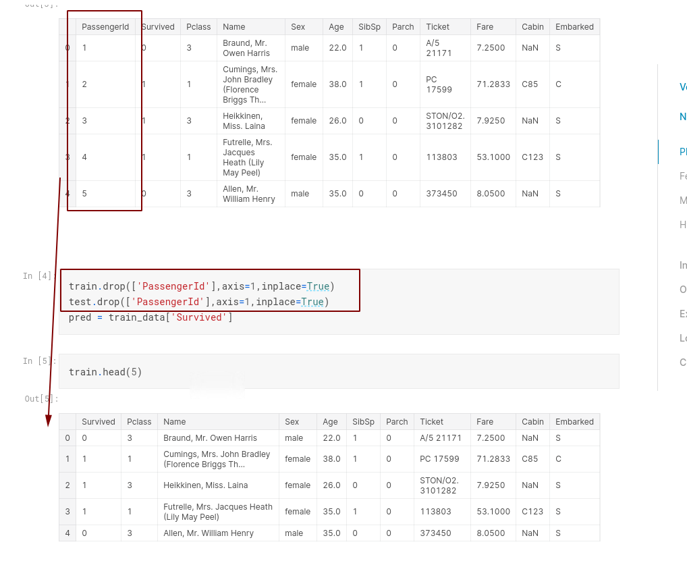


# 缺失值
# 特征
# 模型训练
# 调参

# 总结

应用机器学习，千万不要一上来就试图做到完美，先撸一个baseline的model出来，再进行后续的分析步骤，一步步提高，所谓后续步骤可能包括：
- 分析model现在的状态(欠/过拟合)
- 分析我们使用的feature的作用大小，进行feature selection，
- 以及我们模型下的bad case和产生的原因』等等。

另外还有一些万变不离其宗的道：
- 『对数据的认识太重要了！』
- 『数据中的特殊点/离群点的分析和处理太重要了！』
- 『特征工程(feature engineering)太重要了！在很多Kaggle的场景下，甚至比model本身还要重要』
- 『要做模型融合(model ensemble)啊啊啊！』

最后
- 『解决一个问题的方法和思路不止一种』
- 『没有所谓的机器学习算法优劣，也没有绝对高性能的机器学习算法，只有在特定的场景、数据和特征下更合适的机器学习算法。』